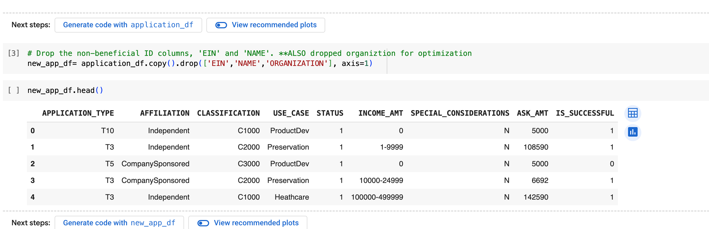
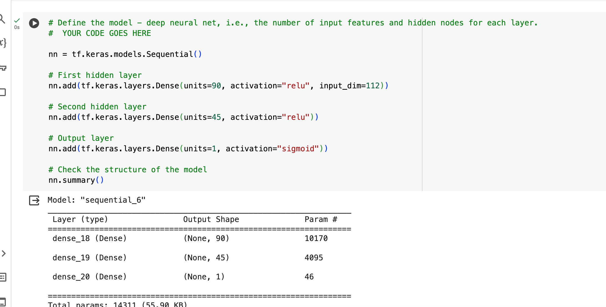

# deep-learning-challenge

# ANALYSIS PURPOSE
 Alphabet Soup is a nonprofit foundation and the purpose of this analysis is to create a binary classifier with deep learning to predict if funding by AlphabetSoup will have an impact on applicants success.

# DATA PREPROCESSING

What variable(s) are the target(s) for your model?
    - The target variable for our model is our "IS SUCCESSFUL" feature column. 
What variable(s) are the features for your model?
    - Variables that are features for our model inclue the following: APPLICATION_TYPE, AFFILIATION,  CLASSIFICATION, USE_CASE, STATUS, INCOME_AMT, SPECIAL_CONSIDERATIONS, ASK_AMT 
What variable(s) should be removed from the input data because they are neither targets nor features?
    - variables that were removed and not features in our model included the following: EIN, NAME, and ORGANIZATION(in my optimization model)

# Compiling, Training, and Evaluating the Model

How many neurons, layers, and activation functions did you select for your neural network model, and why?
- Originally I chose two layers with a relu and sigmoid activiation, given that the variable we were intested in was given in a 0 or 1 format, the output layer being sigmoid made the most sense. 
Were you able to achieve the target model performance? 
    - I was not able to acheive target model performance of 75% the closest I got was with my initial model of two layers that included the ORGANIZATION feature wich had an accuracy of 73.2%
What steps did you take in your attempts to increase model performance?
    - In my first optimization I removed the ORGANIZATION feature and changed around the units leaving the layers at 2, however this brought down my accuracy to 72.2%
    

    - I then decided to add an extra layer to see if that would help distrubute neurons due to the complexity of the features, however in doing so it did not increase my accuaracy by much. It increased to 72.5%

    -Finally I changed the units in each layer to see if that would make an impact on my overall accuracy however, there still was not much change with my accuracy decreasing to 72.4%

# SUMMARY
Overall, it seems that my model did better with 2 layers instead of 3, however for future works I could try adding 4-5 layers and seeing if that would effect the model to yield better results. 